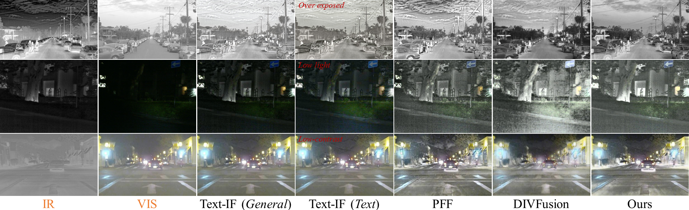
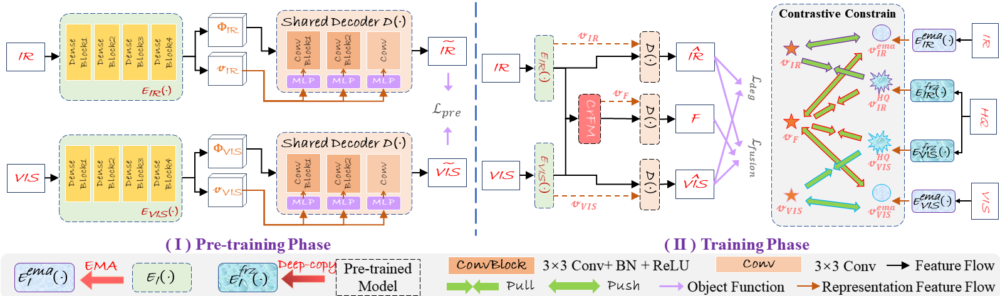

# DAFusion
Source code of the paper ***A Degradation-Aware Guided Fusion Network for Infrared and Visible Image*** which has been accepted by INF FUS.
- Xue Wang, Wenhua Qian, Zheng Guan, Jinde Cao, RunZhuo Ma, and Cong Bi

# Abstract
Most IVIF methods focus solely on visual feature fusion, neglecting degraded scene information, which results in suboptimal solutions that do not fully reflect implicit scene information. To tackle the challenge, we develop a degradation-aware fusion network for infrared and visible images. By learning implicit degradation estimation, our model not only effectively integrates complementary information from source images but also strengthens its robustness against scene degradation. Our method assumes that all source images contain varying degrees of degradation. Based on this assumption, we construct stable positive samples and dynamic negative samples using encoder variants and high-quality, degradation-free images, thus driving the model to identify and optimize degradations in the source images during contrastive learning of unpaired representation features. Additionally, the co-refinement fusion module (CrFM) exploits the interdependence between representation features and source information, enabling it to mine specialized information within each source and complementary information across sources. This facilitates effective feature aggregation while mitigating information loss during fusion. To further enhance the model, we introduce image-level saliency masks and feature-level energy variation masks to reduce the solution domain, encouraging the model to prioritize intrinsic source content, especially details obscured by degradation. Extensive experiments on static data statistics and high-level vision tasks validate the superiority of the proposed method, and its robust anti-degradation capability makes it more stable than other SOTA methods when facing unknown degradations.
# :triangular_flag_on_post: Illustration of our DAFusion

|  |
|:-------------------------------------------:|
| **Figure 1.** The overall architecture of DAFusion |

|  |
|:-------------------------------------------:|
| **Figure 2.**  Demonstration of fused images from different methods |

# :triangular_flag_on_post: Testing
If you want to infer with our DAFusion and obtain the fusion results in our paper, please run ```test.py```.
Then, the fused results will be saved in the ```'./Output/'``` folder.

# :triangular_flag_on_post: Training
You can change your own data address in ```dataset.py``` and use ```train.py``` to retrain the method.


## 🚀 Related Work
- Xue Wang, Wenhua Qian, Zheng Guan, Jinde Cao, RunZhuo Ma, Chengchao Wang. *A Retinex Decomposition Model-Based Deep Framework for Infrared and Visible Image Fusion*. **JSTSP 2024**, [[Ppaer](https://ieeexplore.ieee.org/document/10682806), [Code](https://github.com/wang-x-1997/RDMFuse)] 
- Xue Wang, Zheng Guan, Wenhua Qian, Jinde Cao, Shu Liang, Jin Yan. *CS²Fusion: Contrastive learning for Self-Supervised infrared and visible image fusion by estimating feature compensation map*. **INF FUS 2024**, [Ppaer](https://www.sciencedirect.com/science/article/abs/pii/S156625352300355X)
- Xue Wang, Zheng Guan, Wenhua Qian, Jinde Cao, Chengchao Wang, Runzhuo Ma. *STFuse: Infrared and Visible Image Fusion via Semisupervised Transfer Learning*. **TNNLS 2024**, [Ppaer](https://ieeexplore.ieee.org/abstract/document/10312808)
- Xue Wang, Zheng Guan, Wenhua Qian, Jinde Cao, Chengchao Wang, Chao Yang.  *Contrast saliency information guided infrared and visible image fusion*. **TCI 2023**, [Ppaer](https://ieeexplore.ieee.org/abstract/document/10223277)
- Xue Wang, Zheng Guan, Shishuang Yu, Jinde Cao, Ya Li. *Infrared and visible image fusion via decoupling network*. **TIM 2022**, [Ppaer](https://ieeexplore.ieee.org/abstract/document/9945905)
- Zheng Guan, Xue Wang, Rencan Nie, Shishuang Yu, Chengchao Wang. *NCDCN: multi-focus image fusion via nest connection and dilated convolution network*. **Appl Intel 2022**, [Ppaer](https://link.springer.com/article/10.1007/s10489-022-03194-z)

# Acknowledgement
Great thanks to the code of [CCAM](https://github.com/CVI-SZU/CCAM).
